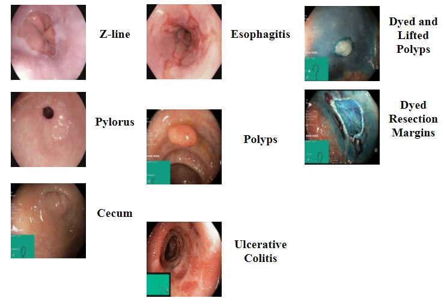
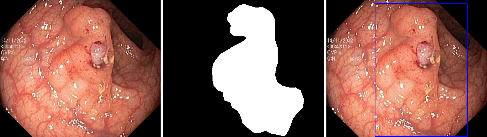
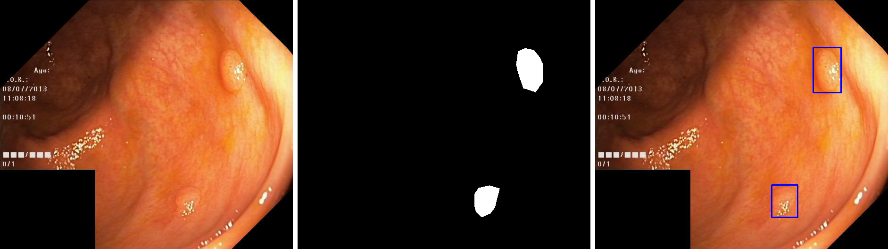
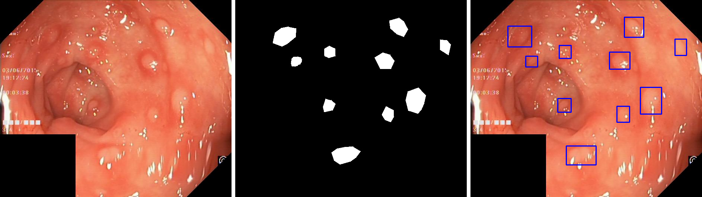
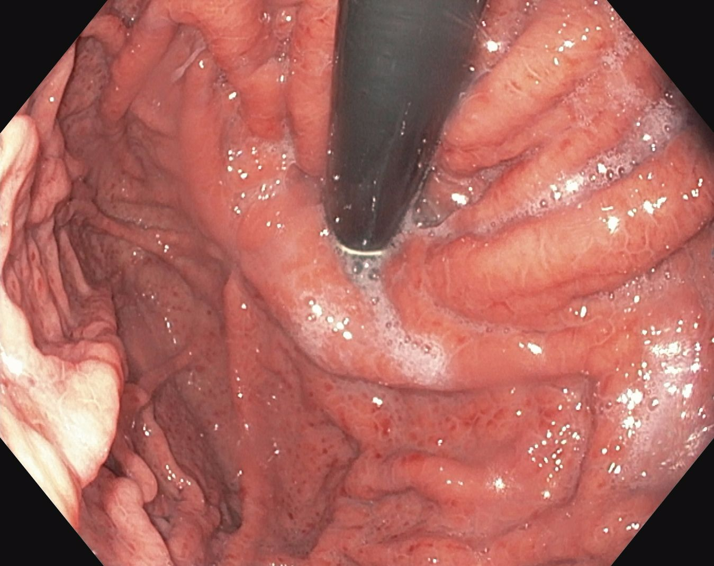
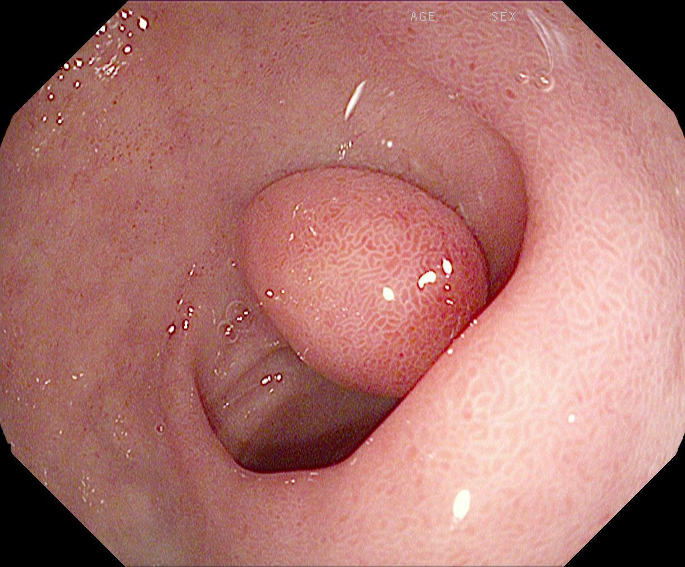
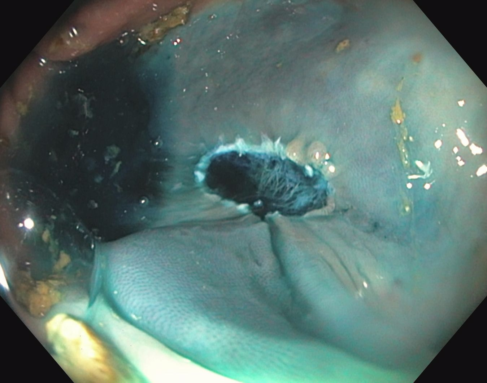

### Endoscopic-3D-Point-Clouds-Datasets
* https://drive.google.com/file/d/11WRGB63X6eR6hd5i1tpem7PkICh8gkMD/view?usp=sharing
* **内容：**
* 数据集包括腹部壁，子宫角，肾切除术场景1，肾切除术场景2和肝脏的场景；提取的每个密集3D点云平均包含大约100,000个点。
* **对应论文：**
* [1] Recovering Dense 3D Point Clouds from Single Endoscopic Image. Subbmitted to Computer Methods and Programs in Biomedicine[J]. 2020.
* [2] Giannarou S, Stoyanov D, Noonan D, et al. Hamlyn centre laparoscopic/endoscopic video datasets[J]. 2012.

# Endoscopic-Datasets

# 1.The Kvasir Dataset

* **内容：** 
   * 分为Kvasir Dataset v1、Kvasir Dataset v2两个版本，两个版本均包含8个类别。其中，解剖标志三类：Z线，幽门，盲肠；病理结果三类：食管炎，息肉，溃疡性结肠炎；内镜检查程序两类："dyed and lifted polyp"，"dyed resection margins"。版本1共包含4000张图像，每类400张。版本2共包含8000张图像，每类800张。分辨率从720x576到1920x1072不等。
* **对应论文：** Pogorelov, K., et al. (2017). Kvasir: A multi-class image dataset for computer aided gastrointestinal disease detection. Proceedings of the 8th ACM on Multimedia Systems Conference.

* **示例图像：**

 

#                                        Kvasir Dataset v1
* Kvasir数据集（v1）的第一版包含8类的4,000张图像，这些图像显示了GI道的解剖标志，病理学发现或内窥镜检查程序，即每类500张图像。解剖学标志是Z线，幽门和盲肠，病理发现是食管炎，息肉和溃疡性结肠炎。此外，我们提供了两组与息肉切除相关的图像，即“染过的息肉和抬高的息肉”和“切除的切除切缘”。
* **Kvasir数据集v1：**    https://datasets.simula.no/kvasir/data/kvasir-dataset.zip
   * 所述kvasir-dataset.zip（尺寸1.2 GB）归档文件包含4000倍的图像，8类，500个图像为每个类。图像存储在单独的文件夹中，该文件夹根据类图像所属的名称进行命名。图像文件使用JPEG压缩进行编码。编码设置在整个数据集中可能有所不同，并且它们反映了先验未知的内窥镜设备设置。图像文件的扩展名是“ .jpg”。
* **提取的功能（Kvasir数据集v1）：**   https://datasets.simula.no/kvasir/data/kvasir-dataset-features.zip
   * 该kvasir-dataset-features.zip（大小4.7 MB）存档包含从Kvasir数据集中提取的所有图像的视觉特征描述符。提取的视觉特征存储在单独的文件夹和文件中，这些文件夹和文件根据相应图像文件的名称和路径进行相应命名。提取的视觉特征是全局图像特征，即：JCD，Tamura，ColorLayout，EdgeHistogram，AutoColorCorrelogram和PHOG。每个特征向量都包含许多浮点值。向量的大小取决于特征。特征向量的大小为：168（JCD），18（Tamura），33（ColorLayout），80（EdgeHistogram），256（AutoColorCorrelogram）和630（PHOG）。提取的视觉特征存储在文本文件中。每个文件由八行组成，每个功能各占一行。每行由一个特征名称组成，该特征名称与特征向量之间用冒号分隔。每个特征向量都包含由逗号分隔的相应数量的浮点值。提取的视觉特征文件的扩展名是“ .features”。
#                                            Kvasir Dataset v2
* Kvasir数据集的第二个版本（v2）扩展了第一个版本，由8类的8,000张图像组成，这些图像显示了GI道的解剖标志，病理学发现或内窥镜检查程序，即每类1,000张图像。这些类别与Kvasir v1中的类别相同：Z线，幽门，盲肠，食道炎，息肉，溃疡性结肠炎，息肉染色和剥离息肉以及切除的切缘。
* **Kvasir数据集v2：**  https://datasets.simula.no/kvasir/data/kvasir-dataset-v2.zip
    * 所述kvasir-dataset-v2.zip（尺寸2.3 GB）归档文件包含8000倍的图像，8类，1000个图像为每个类。图像存储在单独的文件夹中，该文件夹根据类图像所属的名称进行命名。图像文件使用JPEG压缩进行编码。编码设置在整个数据集中可能有所不同，并且它们反映了先验未知的内窥镜设备设置。图像文件的扩展名是“ .jpg”。
* **提取的功能（Kvasir数据集v2）:** https://datasets.simula.no/kvasir/data/kvasir-dataset-v2-features.zip
    * 该kvasir-dataset-v2-features.zip（大小9.3 MB）存档包含从Kvasir Dataset v2中提取的所有图像的视觉特征描述符。提取的视觉特征存储在单独的文件夹和文件中，这些文件夹和文件根据相应图像文件的名称和路径进行相应命名。提取的视觉特征是全局图像特征，即：JCD，Tamura，ColorLayout，EdgeHistogram，AutoColorCorrelogram和PHOG。每个特征向量都包含许多浮点值。向量的大小取决于特征。特征向量的大小为：168（JCD），18（Tamura），33（ColorLayout），80（EdgeHistogram），256（AutoColorCorrelogram）和630（PHOG）。提取的视觉特征存储在文本文件中。每个文件由八行组成，每个功能各占一行。每行由一个特征名称组成，该特征名称与特征向量之间用冒号分隔。每个特征向量都包含由逗号分隔的相应数量的浮点值。提取的视觉特征文件的扩展名是“ .features”。
* **Kvasir数据集v2折叠:**  https://datasets.simula.no/kvasir/data/kvasir-dataset-v2-folds.zip
    * 该kvasir-dataset-v2-folds.zip（大小25.3 GB）存档包含80000个图像。这是从Kvasir数据集（v2）生成的正式图像集，可用于执行多类分类算法的10倍交叉验证。图像存储在单独的文件夹中，该文件夹根据折叠编号和类别图像的名称进行相应命名。所有图像在每个折叠中都统一命名，并且与Kvasir数据集（v2）中的原始图像名称不匹配。图像文件使用JPEG压缩进行编码。编码设置在整个数据集中可能有所不同，并且它们反映了先验未知的内窥镜设备设置。图像文件的扩展名是“ .jpg”。
* **提取的功能（Kvasir数据集v2折叠):**  https://datasets.simula.no/kvasir/data/kvasir-dataset-v2-folds-features.zip
    * 该kvasir-dataset-v2-fold-features.zip（大小98.6 MB）存档包含从Kvasir Dataset v2 Folds提取的所有图像的视觉特征描述符。提取的视觉特征存储在单独的文件夹和文件中，这些文件夹和文件根据相应图像文件的名称和路径进行相应命名。提取的视觉特征是全局图像特征，即：JCD，Tamura，ColorLayout，EdgeHistogram，AutoColorCorrelogram和PHOG。每个特征向量都包含许多浮点值。向量的大小取决于特征。特征向量的大小为：168（JCD），18（Tamura），33（ColorLayout），80（EdgeHistogram），256（AutoColorCorrelogram）和630（PHOG）。提取的视觉特征存储在文本文件中。每个文件由八行组成，每个功能各占一行。每行由一个特征名称组成，该特征名称与特征向量之间用冒号分隔。每个特征向量都包含由逗号分隔的相应数量的浮点值。提取的视觉特征文件的扩展名是“ .features”。
* **Kvasir数据集v2折叠-附加集:**  https://datasets.simula.no/kvasir/data/kvasir-dataset-v2-folds-additional-classes.zip
    * 该kvasir-dataset-v2-folds.zip（尺寸810.9 MB）存档包含20,000多张影像。这是从Kvasir数据集（v2）的扩展生成的官方两类附加图像集，可用于执行多类分类算法的10倍交叉验证。图像存储在单独的文件夹中，该文件夹根据折叠编号和类别图像的名称进行相应命名。所有图像在每个折叠中都统一命名，并且与Kvasir数据集（v2）中的原始图像名称不匹配。图像文件使用JPEG压缩进行编码。编码设置在整个数据集中可能有所不同，并且它们反映了先验未知的内窥镜设备设置。图像文件的扩展名是“ .jpg”。
* **提取的功能（Kvasir数据集v2折叠-附加集）:** https://datasets.simula.no/kvasir/data/kvasir-dataset-v2-folds-additional-classes-features.zip
    * 该kvasir-dataset-v2-fold-features.zip（大小24.3 MB）存档包含从Kvasir Dataset v2 Folds-Additional Set中提取的所有图像的视觉特征描述符。提取的视觉特征存储在单独的文件夹和文件中，这些文件夹和文件根据相应图像文件的名称和路径进行相应命名。提取的视觉特征是全局图像特征，即：JCD，Tamura，ColorLayout，EdgeHistogram，AutoColorCorrelogram和PHOG。每个特征向量都包含许多浮点值。向量的大小取决于特征。特征向量的大小为：168（JCD），18（Tamura），33（ColorLayout），80（EdgeHistogram），256（AutoColorCorrelogram）和630（PHOG）。提取的视觉特征存储在文本文件中。每个文件由八行组成，每个功能各占一行。每行由一个特征名称组成，该特征名称与特征向量之间用冒号分隔。每个特征向量都包含由逗号分隔的相应数量的浮点值。提取的视觉特征文件的扩展名是“ .features”。

# 2. The Kvasir-SEG Dataset  https://datasets.simula.no/kvasir-seg/Kvasir-SEG.zip

* **内容：**

*  在The Kvasir Dataset基础上添加了segmentation masks。包含来自Kvasir Dataset v2的1000张息肉图像和对应的分割ground truth（pixel-wise mask和bounding box），分辨率从332x487到1920x1072不等。 The images and its corresponding masks are stored in two separate folders with the same filename. The image files are encoded using JPEG compression, and online browsing is facilitated. The open-access dataset can be easily downloaded for research and educational purposes.
* **对应论文:** Jha, D., et al. (2020). Kvasir-seg: A segmented polyp dataset. International Conference on Multimedia Modeling, Springer.
* **示例图像:**

 
 
 

# 3. The Hyper-Kvasir Dataset
* **内容** 号称最大的胃肠数据集，大小有58.6G，包含110079张图像和374个视频。数据集分为四大类：
    * 第一类是标注图像，包含10662张图像，相当于[The Kvasir Dataset](https://datasets.simula.no/kvasir/)的扩充。类别包含解剖标志(anatomical landmarks)、病理发现(phatological findings)、正常发现(normal findings)，其中解剖标志又分为上消化道（Z线，反转视角下的胃，幽门）、下消化道（回肠，盲肠，反转视角下的直肠），病理发现包括上消化道病理发现（反流性食管炎，巴雷特食管，）、下消化道病理发现（溃疡性结肠炎，息肉，痔疮），正常发现包括波士顿肠道准备评分、粪便、内镜检查程序（"dyed and lifted polyp"，"dyed resection margins"）。
    * 第二类是分割图像，与[The Kvasir-SEG Dataset](https://datasets.simula.no/kvasir-seg/)相同。
    * 第三类是未标注图像，包含99417张图像。
    * 第四类是标注视频，包含374个视频，每个视频有对应的finding标签，如息肉、出血、肿瘤等。
* **对应论文:** Hyper-Kvasir: A Comprehensive Multi-Class Image and Video Dataset for Gastrointestinal Endoscopy
* **示例图像：**

 
 
 

* **标注图像（3.9GB）:**  https://datasets.simula.no/hyper-kvasir/hyper-kvasir-labeled-images.zip
  * 数据集总共包含10,662张使用JPEG格式存储的带标签的图像。可以在图像文件夹中找到图像。每个图像所属的类对应于它们存储在其中的文件夹（例如，“ polyp”文件夹包含所有息肉图像，“ barretts”文件夹包含所有Barrett食道图像，等等）。每个类文件夹位于描述发现类型的子文件夹中，子文件夹又位于描述较低GI或较高GI发现的文件夹中。每个类别的图像数量不平衡，这是医学领域的一个普遍挑战，因为某些发现比其他发现更频繁地出现。这给研究人员带来了额外的挑战，因为应用于数据的方法还应该能够从少量训练数据中学习。标记的图像代表23种不同的发现类别。
* **分割图像（46MB）:**  https://datasets.simula.no/hyper-kvasir/hyper-kvasir-segmented-images.zip
  * 我们为息肉类中的1,000张图像提供了原始图像，分割蒙版和边框。在蒙版中，描绘息肉组织（感兴趣区域）的像素由前景（白色蒙版）表示，而背景（黑色）不包含息肉像素。边界框定义为找到的息肉的最外面的像素。对于此细分集，我们有两个文件夹，一个用于图像，一个用于遮罩，每个文件夹包含1,000个JPEG压缩图像。相应图像的边界框存储在JavaScript对象表示法（JSON）文件中。图像及其相应的蒙版具有相同的文件名。图像和文件存储在分段图像文件夹中。
* **未标注图像(29.4GB):**  https://datasets.simula.no/hyper-kvasir/hyper-kvasir-unlabeled-images.zip
  * 数据集总共包含99,417张未标记图像。未标记的图像可以与其他标记的图像文件夹一起在未标记的文件夹中找到，该文件夹是图像文件夹中的子文件夹。除了未标记的图像文件外，我们还在Hyper-Kvasir Github存储库中提供了提取的全局特征和群集分配作为属性关系文件格式（ARFF）文件。可以使用例如WEKA机器学习库打开和处理ARFF文件，也可以将它们轻松转换为逗号分隔值（CSV）文件。
* **标注视频(25.2GB):**  https://datasets.simula.no/hyper-kvasir/hyper-kvasir-labeled-videos.zip
  * 数据集中总共提供了374个视频，这些视频存储在称为“标记视频”的文件夹中。视频文件格式为音频视频交织（AVI）。除视频文件外，还提供了一个CSV文件，其中包含视频的videoID和查找内容。VideoID包含相应的视频文件名，而发现内容包含视频中发现内容的描述。对于某些视频，我们包含了第二个发现，但是我们使用第一个发现对视频进行了分类。总共，我们在视频中有30类发现。与带注释的视频类似，它们位于将发现分类的文件夹中，而反过来又位于描述发现是上GI还是下GI的文件夹中。
 

    

